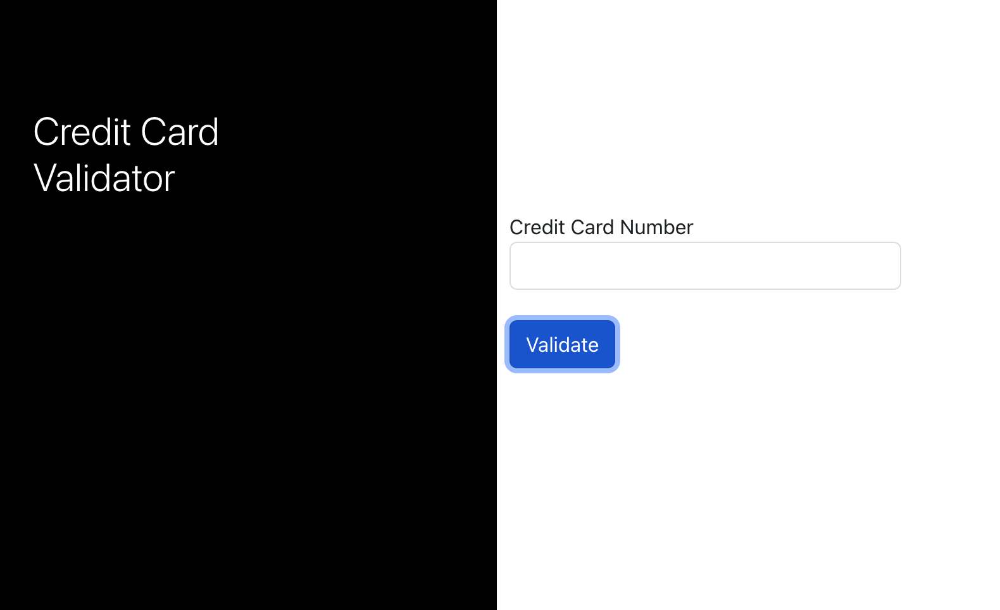

# Engaged MD Take Home

The following project has two parts, an API with one endpoint and a UI that takes a credit card number and calls the API to validate it.

Steps to install and start up the API and UI follow:

## API
1. cd api
2. npm install
3. npm run start

Endpoint is: http://localhost:8080/validate/1

## React UI
1. cd cc-validate-ui/
2. npm install
3. npm start

Screenshot

